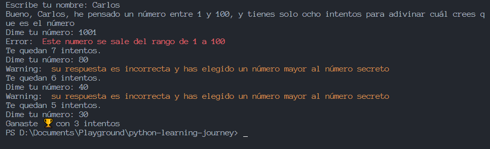

# Day 4

## Equals
```python
# If ther number is greater or equal than
num1=36
num2=17
mi_bool=num1 >= num2 # True

# If the number are equals
num1=25**.5 # root square
num2=5 # number
mi_bool = num1 == num2 # are equals
print(mi_bool) # True

# If are not equals
num1= 64*3
num2= 24*8
mi_bool = num1 != num2
print(mi_bool)
```

## Logic operator
### and
```python
num1=36
num2=72/2
num3=48
# fi num 1 is greater than num2 and num1 is less that num3
mi_bool= (num1>num2)and(num1<num3) 
print(mi_bool)# False
```
### or
```python
num1=36
num2=72/2
num3=48
mi_bool= num1>num2 or num1<num3
print(mi_bool)
```
### not( in )
```python
# If the words are not in the text
frase = "Cuando algo es lo suficientemente importante, lo haces incluso si las probabilidades de que salga bien no te acompañan"
palabra1 = "éxito"
palabra2 = "tecnología"
mi_bool= not (palabra1 in frase) and not (palabra2 in frase)
print(mi_bool) # True
```

## Flow code
```python
# Condition 1
num1 = int(input("Ingresa un número:"))
num2 = int(input("Ingresa otro número:"))

if (num1 > num2):
    print(f"{num1} es mayor que {num2}")
elif (num2 > num1):
    print(f"{num2} es mayor que {num1}")
else:
    print(f"{num1} y {num2} son iguales")

# Condition 2
edad = 16
tiene_licencia = False

if (edad > 18 and tiene_licencia):
    print("Puedes conducir")
elif (edad >= 16 and edad <= 18):
    print("No puedes conducir aún. Debes tener 18 años y contar con una licencia")
elif (edad > 18 and tiene_licencia == False):
    print("No puedes conducir. Necesitas contar con una licencia")

#Condition 3
habla_ingles = True
sabe_python = False

if (habla_ingles and sabe_python):
    print("Cumples con los requisitos para postularte")
elif (not(habla_ingles)):
    print("Para postularte, necesitas tener conocimientos de inglés")
elif (not(sabe_python)):
    print("Para postularte, necesitas saber programar en Python")
```

## Loops
### For
```python
# for 1
alumnos_clase = ["María", "José", "Carlos",
                 "Martina", "Isabel", "Tomás", "Daniela"]

for alumno in alumnos_clase:
    print(f"Hola {alumno}")

# for 2
lista_numeros = [1,5,8,7,6,8,2,5,2,6,4,8,5,9,8,3,5,4,2,5,6,4]
suma_numeros = 0
for num in lista_numeros:
    suma_numeros += num

# for 3
lista_numeros = [1, 5, 8, 7, 6, 8, 2, 5, 2,
                 6, 4, 8, 5, 9, 8, 3, 5, 4, 2, 5, 6, 4]
suma_pares = 0
suma_impares = 0

for num in lista_numeros:
    if (num % 2) == 0:
        suma_pares += num
    else:
        suma_impares += num
```

### While
```python
# while 1
numero = 10
while numero > -1:
    print(numero)
    numero -= 1

# while 2
numero = 50
while numero > -1:
    if (numero % 5 == 0):
        print(numero)
    numero -= 1
```

### break
```python
lista_numeros = [4,5,8,7,6,9,8,2,4,5,7,1,9,5,6,-1,-5,6,-6,-4,-3]

for item in lista_numeros:
    if item < 0:
        break
    print (item)
```

## Range
```python
# case 1
mi_lista = list(range(2500, 2585))
print(mi_lista)

# case 2
suma_cuadrados = 0
for item in range(1, 16):
    suma_cuadrados += item**2
```

## Enumerate
```python
# case 1
lista_nombres = ["Marcos", "Laura", "Mónica", "Javier",
                 "Celina", "Marta", "Darío", "Emiliano", "Melisa"]
for nombre, indice in enumerate(lista_nombres):
    print(f'{indice} se encuentra en el índice {nombre}')

# case 2
lista_indices = list(enumerate("Python"))
print(lista_indices)

# case 3
lista_nombres = ["Marcos", "Laura", "Mónica", "Javier",
                 "Celina", "Marta", "Darío", "Emiliano", "Melisa"]

for index, name in list(enumerate(lista_nombres)):
    if name.startswith("M"):
        print(index)
```

## Zip
```python
capitales = ["Berlín", "Tokio", "París", "Helsinki", "Ottawa", "Canberra"]
paises = ["Alemania", "Japón", "Francia", "Finlandia", "Canadá", "Australia"]

for country, city in list(zip(paises, capitales)):
    print(f"La capital de {country} es {city}")

# case 2
espanol = ["uno", "dos", "tres", "cuatro", "cinco"]
portugues = ["um", "dois", "três", "quatro", "cinco"]
ingles = ["one", "two", "three", "four", "five"]

numbers = list(zip(espanol, portugues, ingles))
print(numbers)
```

## Min Max
```python
lista_numeros = [44542247/2, 21310/5, 2134747*33, 44556475, 121676, 6654067, 353254, 123134, 55**12, 611**5]
valor_maximo = max(lista_numeros)

# case 2
lista_numeros = [44542247, 21310, 2134747, 44556475,
                 121676, 6654067, 353254, 123134, 552512, 611665]
rango = [min(lista_numeros), max(lista_numeros)]
print(rango)

# case 3
diccionario_edades = {"Carlos":55, "María":42, "Mabel":78, "José":44, "Lucas":24, "Rocío":35, "Sebastián":19, "Catalina":2,"Darío":49}

edad_minima = min(diccionario_edades.values())
ultimo_nombre = max(diccionario_edades.keys())
```

## Ramdom
### Ramdint
```python
# case 1 to 10
from random import randint
aleatorio = randint(1, 10)
print(aleatorio)

# case 0 to 1 in decimals
from random import *
aleatorio = random()
print(aleatorio)

# Chose an option
from random import *
nombres = ["Carlos", "Julia", "Nicole", "Laura", "Mailen"]
sorteo = choice(nombres)
print(sorteo)
```

### List compresion
```python
# case 1
valores = [1, 2, 3, 4, 5, 6, 9.5]
valores_cuadrado = [n**2 for n in valores]
print(valores_cuadrado)

# case 2
valores = [1, 2, 3, 4, 5, 6, 9.5]
valores_pares = [n for n in valores if n % 2 == 0]
print(valores_pares)

#case 3
temperatura_fahrenheit = [32, 212, 275]
grados_celsius = [(gFahrenheit-32)*(5/9)
                  for gFahrenheit in temperatura_fahrenheit]
print(grados_celsius)
```

## Result of the exercise in the day 4


## 
```python
```
## 
```python
```
## 
```python
```