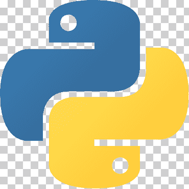

[![Contributors][contributors-shield]][contributors-url]
[![Forks][forks-shield]][forks-url]
[![Stargazers][stars-shield]][stars-url]
[![Issues][issues-shield]][issues-url]
[![MIT License][license-shield]][license-url]
[![LinkedIn][linkedin-shield]][linkedin-url]

<br />
<div align="center">
  <a href="https://github.com/cavidev/python-learning-journey">
    
  </a>

  <h3 align="center">Python 3.10.4</h3>

  <p align="center">
    An awesome ROADMAP to learn and practice with Python
    <br />
    <a href="https://github.com/cavidev/python-learning-journey"><strong>Explore the docs »</strong></a>
    <br />
    <br />
    <a href="https://github.com/cavidev/python-learning-journey">View Demo</a>
    ·
    <a href="https://github.com/cavidev/python-learning-journey/issues/new?labels=bug&template=bug-report---.md">Report Bug</a>
    ·
    <a href="https://github.com/cavidev/python-learning-journey/issues/new?labels=enhancement&template=feature-request---.md">Request Feature</a>
  </p>
</div>

<!-- ABOUT THE PROJECT -->
## About The Project

Hi my name is Carlos and I am learning "or re-learning" Python, following this course: [Python in 16 days](https://www.udemy.com/share/105A0u3@gSzd0s1P0H3LY9JMCwMAKj9CacVI7pn4xwnq6CLW3lOUsnPiF8WYHrubSjZcs1waHQ==/)


- My idea is: to refresh all my knowledge in Python language and try to enjoy it.
- The course is in Spanish (but my comments and some notes will be in english), and have lot of content about python and how use it. 
- The most funny are the video games that you will create.

### Built With
* [![Python][Python.org]][Python-url]

### Installation

1. Install latest Python.org
   - [Python Dowloand](https://www.python.org/downloads/)
2. Clone the repo
   ```sh
   git clone https://github.com/cavidev/python-learning-journey.git
   ```
4. Run the projects
    Each day has a project, to which I apply all knowledge acquired that day.
    You can entry in each day an run each project
    ```sh
    python Day<...>/project.py
    ``` 

<p align="right">(<a href="#readme-top">back to top</a>)</p>

## Roadmap
- [X] [Day 1](https://github.com/cavidev/python-learning-journey/tree/main/Day%201)
    - First steps 
    - Know the enviroment
- [X] [Day 2](https://github.com/cavidev/python-learning-journey/tree/main/Day%202)
    - Know the data types
    - Doing an calculator
- [X] [Day 3](https://github.com/cavidev/python-learning-journey/tree/main/Day%203)
    - Know the list, tuples, set, dic and the method of each structure 
- [Day #]()
- [Day #]()
- [Day #]()
- [Day #]()
- [Day #]()
- [Day #]()
- [Day #]()
- [Day #]()
- [Day #]()
- [Day #]()
- [Day #]()
- [Day #]()
- [Day #]()

<p align="right">(<a href="#readme-top">back to top</a>)</p>

### Contact me
If you want to learn or discuss it, contact me by email. 
I love to learn and teach from and to other people.

<p align="right">(<a href="#readme-top">back to top</a>)</p> 

<!-- MARKDOWN LINKS & IMAGES -->
<!-- https://www.markdownguide.org/basic-syntax/#reference-style-links -->
[contributors-shield]: https://img.shields.io/github/contributors/cavidev/python-learning-journey.svg?style=for-the-badge
[contributors-url]: https://github.com/cavidev/python-learning-journey/graphs/contributors
[forks-shield]: https://img.shields.io/github/forks/cavidev/python-learning-journey.svg?style=for-the-badge
[forks-url]: https://github.com/cavidev/python-learning-journey/network/members
[stars-shield]: https://img.shields.io/github/stars/cavidev/python-learning-journey.svg?style=for-the-badge
[stars-url]: https://github.com/cavidev/python-learning-journey/stargazers
[issues-shield]: https://img.shields.io/github/issues/cavidev/python-learning-journey.svg?style=for-the-badge
[issues-url]: https://github.com/cavidev/python-learning-journey/issues
[license-shield]: https://img.shields.io/github/license/cavidev/python-learning-journey.svg?style=for-the-badge
[license-url]: https://github.com/cavidev/python-learning-journey/blob/master/LICENSE.txt
[linkedin-shield]: https://img.shields.io/badge/-LinkedIn-black.svg?style=for-the-badge&logo=linkedin&colorB=555
[linkedin-url]: https://linkedin.com/in/carlosmariovillafuerte

[Python.org]: https://img.shields.io/badge/Python-3776AB?style=for-the-badge&logo=python&logoColor=fff
[Python-url]: https://www.python.org/